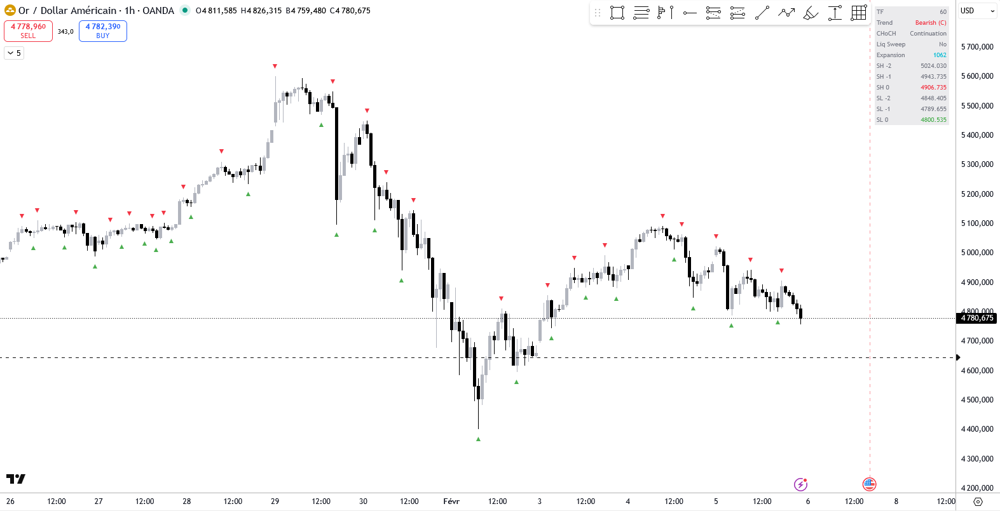

# JCO Swings Trend HTF

Pine Script indicator for TradingView that detects swing highs and lows on a higher timeframe (HTF) and determines the trend direction based on swing structure.

## Features

- **Trend Detection**: Identifies Bullish/Bearish trends with Momentum or Compression status
- **CHoCH Detection**: Change of Character detection for potential trend reversals
- **Liquidity Sweep Detection**: Identifies liquidity grabs with close price confirmation
- **Swing Alternation**: Enforces High-Low-High-Low sequence for clean swing structure
- **Multi-Timeframe**: Works on any timeframe while analyzing swings from a higher timeframe

## Dashboard

The indicator displays a compact dashboard with:

| Field | Description |
|-------|-------------|
| TF | Selected swing timeframe |
| Trend | Current trend direction with status (M=Momentum, C=Compression) |
| CHoCH | Change of Character status (Bullish/Bearish/Continuation) |
| Liq Sweep | Liquidity sweep detected (Yes/No) |
| Expansion | Distance between last swing high and low in pips |

## Parameters

### Swings H & L
- **Swing Period**: Number of bars for pivot detection (default: 5)
- **Swing Time Frame**: Higher timeframe for swing analysis (default: 60 min)

### Swings Chart
- **Draw Icons**: Show swing high/low markers on chart
- **Icon Gap (% of price)**: Distance of icons from price level
- **Display Dashboard**: Show/hide the dashboard table
- **Show SH/SL Values**: Display swing high/low price values in dashboard
- **Dashboard Border Width**: Border thickness (0 = no borders)

## Trend Logic

### Primary Analysis
- **Bullish**: Higher lows structure (LL3 < LL2 < LL1)
- **Bearish**: Lower highs structure (HH3 > HH2 > HH1)

### Status
- **Momentum**: Both highs and lows confirm the trend direction
- **Compression**: Primary structure intact but opposite swings are blocked

## CHoCH (Change of Character)

Detects potential trend reversals by evaluating the previous trend (using swings 1, 2, 3) and checking if swing 0 breaks swing 1 with close confirmation:

- **Bullish CHoCH**: Previous trend was not bullish + higher high (swing 0 > swing 1) + close confirmation
- **Bearish CHoCH**: Previous trend was not bearish + lower low (swing 0 < swing 1) + close confirmation

Close confirmation uses a 5-candle window (2 before, pivot, 2 after) in the swing timeframe to handle immediate rebalance scenarios (long wick candles).

## Liquidity Sweep

Detects when price takes out liquidity at a swing level before reversing.

### Bullish Trend (analyze lows)
- **Case 1**: Low1 < Low2 AND Low0 > Low1 AND High0 > High1 → Price swept low1 and reversed
- **Case 2**: Low0 < Low1 AND (Close0 > Low1 OR High0 > High1) → New low made but rejected

### Bearish Trend (analyze highs)
- **Case 1**: High1 > High2 AND High0 < High1 AND Low0 < Low1 → Price swept high1 and reversed
- **Case 2**: High0 > High1 AND (Close0 < High1 OR Low0 < Low1) → New high made but rejected

## Installation

1. Open TradingView and go to Pine Editor
2. Copy the indicator code
3. Click "Add to Chart"

## License

This project is licensed under the Mozilla Public License 2.0 - see the [LICENSE](https://mozilla.org/MPL/2.0/) for details.

## Author

- **jcornier** - [GitHub](https://github.com/jcornierfra)
